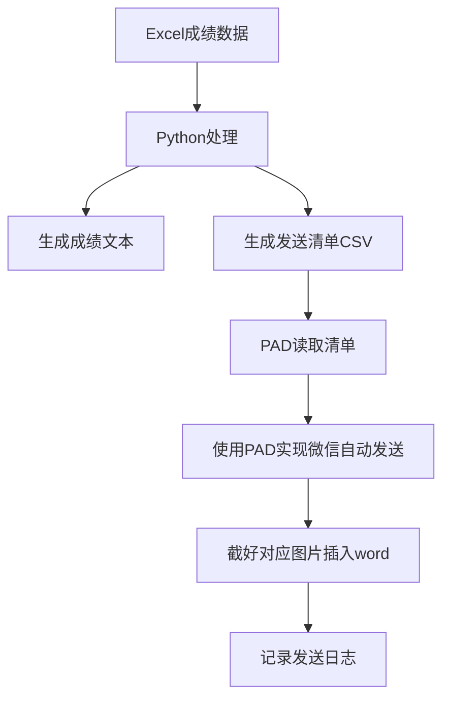

# 📊 Auto Send Succession---Auto Send For Tech

[](https://www.python.org/downloads/)
[](LICENSE)
[](https://www.microsoft.com/windows)

## 📝 项目简介

人工进行某种简单但是极度重复枯燥的操作无疑是不健康的，例如每个学期结束后发送每一位学生的成绩以及一个班级成绩分析的PDF给对应的家长以及最后需要将发送记录进行截图插入家校联系word里面，为此特地搭建一个特定工作流来减少时间成本，顺便开一个新系列Auto Send，专门用于自动化一系列发送行为。经过考虑使用的rpa软件是PAD、通过微信UI来实现较强的适配性和鲁棒性，搭建好对应PAD工作流之后，直接启动即可。

具体搭建思路：写一个py预处理成绩excel，输出每一位同学的成绩txt和一份包含三个学生联系人关键词以上的dispatch_list.csv，PAD通过读取csv知道每一轮要进行发送操作的学生姓名、对应成绩txt存放路径、学生联系人关键词，先通过关键词在微信搜索对应学生联系人进入聊天界面，使用快捷键Control+C、Control+V、Enter来发送对应消息。对于要发送的班级成绩PDF，只需要在循环里面设置好要发送的文件的路径以及发送的行为即可。剩下word插入图片，预先在特定表格插入好对应学生姓名的书签（例如：A截图），在PAD读取相应参数获得对应插入位置然后将PAD截的图插图即可。py以及flow都可以进进一步修改来更加契合需求。

**❗ 注意事项**

- ⚠️ 请确保微信已登录并保持在线
- ⚠️ 建议先小批量测试
- ⚠️ 确保参数准确
- ⚠️ 每一个案例都是有具体参数的，该flow不保证打包下来直接运行就能完成你的需求
- ⚠️ 真实需求的可以联系我先模拟，如果你成为了我的客户，那你就是我的上帝


关于这部分的想法会专门在**💡闲聊**板块说明。(read me first)


## 🎞️ flow show-how

[](https://www.bilibili.com/video/BV1ReHczeEV2/?spm_id_from=333.1387.homepage.video_card.click)

点击观看演示 👆


**📝 to-do list**

| Status | Priority | Category | Feature / Task                                         | Notes                  |
| :----: | :------: | :------- | :----------------------------------------------------- | :--------------------- |
|   📝    |    🔥     | 核心功能 | 更加一步到位的不同类型文件发送方式                     | 提升发送文件的兼容性   |
|   📝    |    🔥     | 核心功能 | 允许用户勾选特定学生进行发送，而不是全部发送           | 提升灵活性             |
|   📝    |    🔥     | 健壮性   | 为微信消息发送失败（如网络问题）增加重试机制           | 增加流程稳定性         |
|   ⏳    |    🔥     | 日志功能 | 存放flow工作时候的状态和每一次循环的结果               | 监督flow工作状态       |
|   📝    |    🔥     | 用户体验 | 将所有配置（文件路径、消息文本）移入 `config.ini` 文件 | 避免修改代码           |
|   📝    |    🔥     | 核心功能 | 增加对邮件(Email)发送渠道的支持                        | 作为微信发送的备用方案 |
|   ✅    |    ↔️     | 文档     | 编写项目 `README.md` 工作流说明                        | 已完成                 |
|   ❌    |    🔽     | 数据处理 | 支持从数据库直接读取学生成绩                           | just no right🐶         |

---


## ✨ 功能特性

- 📈 批量处理Excel成绩数据
- 📝 自动生成个性化成绩单
- 🤖 Power Automate Desktop集成
- 💬 微信自动发送
- ✍️ 发送记录截图自动插入word
- 📊 支持多种成绩格式
- 🔄 批量处理与错误重试

## 🚀 快速开始

### 系统要求

- Windows 10/11
- Python 3.7+
- Power Automate Desktop
- 微信PC版

### 安装步骤

1. **克隆仓库**
```bash
git clone https://github.com/Elixk/auto-send-for-tech.git
cd auto-send-for-tech
```

2. **安装Python依赖**
```bash
pip install pandas openpyxl
```

3. **配置Power Automate Desktop**
下载，安装、登录、导入即可

## 📖 使用指南

### 1. 准备数据

#### Excel格式要求
grade.xlsx(命名可改)

#### 示例数据结构
```
学号 | 姓名 | 科目 | 成绩 | 家长昵称(可选)
```

### 2. 运行Python脚本

```bash
python main.py
```

### 3. 执行PAD工作流

*在主循环开始前，机器人会执行一次准备工作。*

1. **`启动 Word`**: 打开 `家校联系.docx` 日志文件，并将其存入一个变量 (%$WordInstance$%) 中，以便后续操作。

2. #### **`从 CSV 文件读取`**: 读取 `dispatch_list.csv` 指令清单的全部内容（$Student\_Name,Weixin\_Contacts\_Primary,Weixin\_Contacts\_Secondary,Weixin\_Contacts\_Tertiary$），并将其存入一个数据表变量 (%$DispatchTable$%) 中。

**主循环 (Main Loop)**

> *flow开始 `For each` 循环，逐一处理 %$DispatchTable$% 中的每一行（即每一位学生）。*

**循环内核心逻辑 (Core Logic Inside the Loop)**

> *对于每一位学生，flow会执行以下操作：*
>
> **a. 读取学生成绩单**
>
> 1. **`设置变量 Success = false`**: 在处理每个新学生时，首先重置成功标志。
> 2. **`从文件读取文本`**: 根据当前行中 `text_file_path` 列提供的**绝对路径**，读取对应 学生姓名+成绩 `.txt` 成绩单的全部内容，并存入文本变量 %$txtContents$%。
>
> **b.自动查找微信联系人**
>
> - flow会按照 `primary` -> `secondary` -> `tertiary` 的顺序，依次尝试查找家长。
> - 使用 **`If %Success% == false`** 的判断结构，确保一旦某个联系人被成功找到并发送消息后，就会自动跳过对后续其他联系人的尝试。
> - 每次查找后，都会使用 **`If UI 元素在窗口中存在`** 来验证是否成功进入了聊天窗口。
>
> **c. 发送信息**
>
> - 在成功找到联系人并进入聊天窗口后，flow会执行：
>   1. **发送成绩单**: 使用 `设置剪贴板文本` 将 %$txtContents$% 的内容复制到剪贴板，然后模拟 `Ctrl+V` 粘贴并发送。
>   2. **发送PDF**: 使用**模拟手动复制文件**的稳定方法（打开文件夹->选中文件->复制->粘贴）来发送通用的 `班级成绩分析.pdf`。
>
> **d. 截图与存档**
>
> - 在成功发送所有信息后，flow会执行：
>   1. **`截取屏幕截图`**: 截取整个微信窗口。
>   2. **`裁剪图像`**: 根据预设的坐标 (X, Y, 宽度, 高度)，从完整截图中裁剪出对应的聊天记录区域。
>   3. **构造书签名称**: 根据当前学生姓名（例如“A”），动态生成书签名称（例如 A截图 ）。
>   4. **`在 Word 文档中插入图像`**: 在Word文档中找到对应的书签位置，并将裁剪好的截图插入。

**清理与收尾 (Cleanup and Finalization)**

> *在 `For each` 主循环结束后，flow会执行：*
>
> 1. **`关闭 Word`**: 保存并关闭 `家校联系.docx` 文档，完成所有记录。

## 📁 项目结构

```
auto-send-for-tech/
├── main.py                 # 主程序：处理Excel并生成发送清单
├── grade.xlsx             # 成绩数据文件
├── dispatch_list.csv      # 生成的发送清单
├── grade_text/           # 生成的成绩文本文件目录
│   ├── A成绩.txt
│   ├── B成绩.txt
│   └── ...
├── PAD_Workflow.pad      # Power Automate Desktop工作流文件
└── README.md            # 项目说明文档
```

## ⚙️ 配置说明

### Python脚本配置

```python
# main.py 配置项
excel_file = "grade.xlsx"        # Excel文件名
save_dir = "grade_text"          # 文本保存目录
dispatch_list_file = "dispatch_list.csv"  # 发送清单文件
```

### PAD工作流配置

win10/11，软件里面的函数、参数、变量、功能等，其余无

## 🔧 高级功能

### 自定义联系人匹配规则

现实数据表明给家长署名基本都是学生姓名+爸爸、妈妈或者家长，所以暂时只用了三列来构建关键词，如果有其他需求可额外添加，后期也考虑接入ai的api看看能不能实现只通过学生姓名就能找着对应家长

### 日志记录

该flow工作会生成一份日志，里面将会标注出来谁没有发送成功，因为什么原因，用户可考虑完善flow或者手动完成失败任务

## 📊 工作流程图



## 🐛 故障排除

### 常见问题

1. **问题：找不到联系人**
   - 写入工作日志
2. **问题：发送失败**
   - 得细分看是什么情况导致的发送失败

## 📈 版本历史

### v2.1.1 (2025-09-29)

- 🎉 初始版本发布
- ✨ 基础功能实现

### demo (2025-09-23)

- 简略流程的文字发送

## 🤝 贡献指南

欢迎提交Issue和Pull Request！

1. Fork 本仓库
2. 创建你的特性分支 (`git checkout -b feature/AmazingFeature`)
3. 提交你的修改 (`git commit -m 'Add some AmazingFeature'`)
4. 推送到分支 (`git push origin feature/AmazingFeature`)
5. 开启一个Pull Request

## 📄 许可证

本项目采用 MIT 许可证 - 查看 [LICENSE](LICENSE) 文件了解详情

## 👥 作者

- **Backal（Elixk）** - *初始工作* - [GitHub](https://github.com/yourusername)

## 🙏 致谢

- 炜哥的思路来源和现实数据
- 老浦
- 我的两个小号

## 💡 闲聊

- 关于rpa软件的选择：可以使用的rpa软件（平台）其实很多，n8n、automa、Uipath、PAD、影刀、一些开源项目软件等等，各自都有优缺点，例如n8n最强单体但是需要提前部署，因此可能会涉及到环境问题；automa侧重web端；影刀为国产软件，但是安装这个软件可能都会遇上问题；相比之下PAD是微软出的，对于win用户很友好，只需要安装好PAD导入工作流即可
- 关于微信UI：微信首先本来就不开放API，这直接断掉了程序之间的自动化的这条路；同时微信久经更新，可以说是越来越臃肿闭塞，3.X版本可以通过软件来获取对应部件（Pane）的具体窗口程序，4.X版本因为微信主页面窗口“一体化”，只能通过预先record定位到对应搜索框、聊天框位置实现对应操作；github上也有一些微信自动操作的项目介绍，但是也受到微信版本限制，例如**wxauto**。所以考虑到用户使用的微信版本不确定和附带的一系列问题，最后选择了使用UI，微信除非大版本更新，ui界面基本不会变动
- 关于第二点的补充：想获取软件对应部件（Pane）的具体窗口程序，可以使用**accessible inside for win**以及**inspect.exe**,所以其实想实现软件爬虫就可以用这两个来获取具体窗口程序，自动循环读取、存储对应内容。微信无论是web端还是Android端都可回退版本的，关于这些有需求可以另写文章实践操作
- 我认为其实最优解还是用AI+MCP来实现这种flow，当你用自然语言就可以实现跟自己搭建flow的效果一样的时候，machine isn't a machine，当然了，最重要的还是精度问题
- 这个auto send for tech是auto send系列里面的一个，如果有其他需求的可以联系我，鄙人涉猎众多，兴趣之一就是致力于技术解决现实个人需要的问题然后开源
- “不定期”分享开源项目和闲聊操作文章在我的github和blog，但是写readme跟原创文真的是太花时间了，而且写了懒得上上传（🐶）

---

⭐ 如果这个项目对你有帮助，请给个Star！


